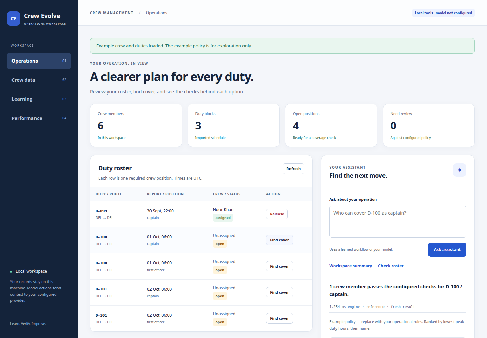

# Crew Evolve

A crew-management assistant that learns how your team works, while keeping operational decisions inspectable.

Import unfamiliar crew tables, review the mapping, find cover for a duty, and see the reasons behind every candidate. Corrections improve future imports and question routing. Planning-policy changes stay as measured proposals until an operator activates them. A separate optimization agent compares algorithms and selects the fastest measured strategy that preserves the reference result.

This is a fresh implementation with synthetic example data. It is an initial local workspace, not a certified scheduling or compliance product.



## Run

Python 3.10 or later. No runtime packages, frontend build, or model key required for the operations workspace.

```bash
git clone https://github.com/disc0nnctd/crew-evolve.git
cd crew-evolve
python3 -m crew_evolve.server
```

Open **http://127.0.0.1:8780** and choose **Explore example data**. The SQLite workspace is stored in `.crew-evolve/`, outside version control. Use `--port` or `--data-dir` for another local workspace.

## What works

| Area | Current behavior |
| --- | --- |
| Data understanding | CSV, TSV, JSON arrays, and JSONL; field aliases, explicit mapping review, optional model suggestions, strict validation, retained original content |
| Crew operations | Duty-block roster, open positions, coverage candidates, assignment and release, source records, reasons for exclusion |
| Planning checks | Availability, role, recorded fleet qualification, duty length, rest before and after, overlap, location continuity, rolling seven-day duty hours |
| Learning | Approved mappings and corrected workflow phrases become tested, persistent configuration; conflicts are rejected; active learning can be rolled back |
| Policy evolution | Editable proposals or model-drafted parameter changes, before/after roster comparison, explicit human activation, stale-proposal rejection |
| Algorithm evolution | Reference scans versus assignment indexes and an event-sweep algorithm; exact-result gate, held-out workloads, latency/memory scores, automatic selection within the reviewed catalog |
| Repeated queries | Bounded result cache; data, assignment, policy, and strategy revisions invalidate prior results |

### Try the learning loop

1. Load the example and check cover for `D-100 / captain`. Asha passes; Noor is excluded for insufficient rest.
2. In **Learning**, teach “Find someone for D-100 as captain” to mean coverage.
3. Ask “Find someone for D-101 as captain”. The saved workflow transfers to the other duty, without a model call.
4. Import `examples/unfamiliar-crew.csv`. Map `Badge` to `crew_id`, `Person` to `name`, and `Home station` to `base`, then review the remaining fields.
5. Inspect that file again. The reviewed mappings are now suggested automatically. The learning history shows the replay and supports rollback.

An import **replaces** the selected table. Replacing crew with the unfamiliar example will leave the old assignments referencing missing crew; the workspace reports this and blocks coverage until resolved. It does not silently delete assignments.

## Model-assisted actions

Configure a chat-completions compatible endpoint:

```bash
export CREW_MODEL_URL=http://127.0.0.1:11434/v1
export CREW_MODEL=your-model-name
# export CREW_MODEL_KEY=...  # if required by your provider
python3 -m crew_evolve.server
```

The `.env.example` file documents these variables; it is not automatically loaded. Keys remain server-side and are never returned to the browser or committed.

The model can suggest field mappings, route a question to an allowed operation, or draft policy parameters. It cannot execute code, assign crew, activate policy, or write answer figures. Coverage answers are rendered from engine results. A learned workflow can answer without a model; an unfamiliar question needs one.

**Data sent on an AI action:** mapping suggestions send headers and three sample records; question routing sends the question and normalized duty metadata; policy drafting sends the requested change and current policy. No background model calls occur. The transport is tested with synthetic responses; a real provider has not been live-verified in this first version.

## Measurements

The [typed-decision research](docs/TYPED_DECISIONS.md) follows the Jev/Laya
discussion with an offline comparison on requests and column mappings derived
from our samples. It includes source links, frozen evaluation fixtures, raw
predictions, and optional reproduction commands. These models are experimental;
they are not used by the operations workspace.

```bash
python3 -m unittest discover -v
python3 -m crew_evolve.optimize --sizes 100,1000,5000 --repeats 7 \
  --output docs/benchmark-results.json
```

The [recorded benchmark](docs/benchmark-results.json) contains actual local results, including machine details. [Metrics and scoring](docs/METRICS.md) defines what they establish and what they do not. The **Performance** screen runs a smaller comparison in the background and activates the best candidate only when every correctness check passes.

Optional real-browser verification:

```bash
python3 -m pip install -r requirements-dev.txt
python3 -m playwright install chromium
python3 -m tests.browser_check
```

This exercises importing, learned mappings, workflow transfer, coverage, assignment/release, reviewed policy activation, benchmark selection, and mobile layouts. Screenshots go to `artifacts/` and are not committed. GitHub checks run the unit and browser suites.

## Current boundaries

- Single operator, one local machine, SQLite. The server binds to loopback. Authentication, tenants, distributed workers, and fleet-scale deployment are not implemented.
- Import limit: 50,000 records per file, 8 MB per request (browser file limit: 6 MB). Data is held in memory during checks; this is not streaming ingestion.
- Duty blocks must already exist. The assistant does not build duties from flight legs. Each listed role represents one position on a duty; multi-seat counts are not modeled.
- Example policy values are illustrative. Certification expiry, leave windows, positioning, flight-time limits, jurisdiction rules, and missing duty history are not inferred.
- Planning evolution changes supported policy parameters, not arbitrary scheduling code. Algorithm evolution selects from reviewed implementations, not untrusted model-generated code.
- Workflow learning matches a corrected phrase with duty and role substitutions; it is not general semantic fine-tuning. Conflicting corrections require reconciliation; they are not silently overwritten.
- Policy comparisons are limited to 50,000 crew-position checks. Coverage returns the top 100 candidates after evaluating all crew; the roster displays the first 100 positions. These are explicit prototype bounds.
- Original imports and action history are retained locally. There is no archival/export lifecycle or multi-version roster restoration yet. Learning rollback does not rewrite already-imported data.

See [architecture](docs/ARCHITECTURE.md), [data contract](docs/DATA.md), and [scaling plan](docs/SCALING.md).
