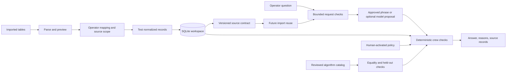

# Architecture

The local HTTP server, browser, and application share one SQLite workspace.
The server binds to loopback, limits request bodies, checks the browser origin,
and gives each workspace process a token for writes. Built distributions carry
the web files and examples; a checkout uses the same resource lookup with a
source-tree fallback.

## Interpretation and learning

An import is parsed, staged, and shown for review. A named source contract binds
an exact table kind, ordered headers, field mapping, and a closed transform
vocabulary. Supported transforms are identity, explicit boolean conversion and
inversion, explicit enum values, and datetime parsing with a declared format
and timezone. The **Test preview** operation applies the candidate to copied
raw rows before the table can be replaced.

Accepted contracts are scoped by source name and exact columns. Their evidence
keeps at most 128 reviewed imports for one scope and at most 32 diverse rows
from each import. This is bounded replay evidence for a reviewed meaning, not
an accuracy estimate for unseen exports. A failed replay remains recorded as a
rejection. A later version can be rolled back; imported datasets and their raw
records remain unchanged, while future reuse returns to the prior contract.

Question routing has a separate boundary. The request guard rejects writes,
missing or ambiguous targets, prompt-like instructions, and mixed operations.
Approved workflow phrases use bounded matching for coverage, roster, and
summary. They do not perform semantic training. An optional local model can
rank approved examples from cached files, but its candidate still needs review
and the operations engine remains authoritative.

## Operational decisions

The engine receives normalized crew, duty, and assignment records. It checks
availability, role, recorded fleet qualification, duty duration, rest,
overlap, location continuity, assignments, and rolling seven-day hours. It
returns candidate reasons and source references; it does not infer missing
flight legs or regulatory rules.

Policy edits are proposals. The application compares the current and proposed
outcomes, records the report, and waits for explicit activation. Assignment
writes use an immediate transaction and recheck both workspace revision and
crew eligibility before committing. A stale revision is rejected.

`Engine` builds a defensive indexed snapshot for one workspace revision and
strategy. The application keeps a small versioned snapshot cache and a bounded
query-result cache; data, policy, assignment, or strategy changes advance the
revision and make prior answers ineligible. The reference strategy remains an
oracle for reviewed algorithm comparisons.

## Modules

| Module | Responsibility |
| --- | --- |
| `data.py` | CSV/TSV/JSON parsing, aliases, normalization, and row validation |
| `contracts.py` | Closed, declarative source transforms and fingerprints |
| `contract_learning.py` | Scoped evidence, replay, versioning, rejection, and promotion |
| `workflows.py` | Bounded approved phrase routing and request guards |
| `local_model.py` | Opt-in cached local candidate retrieval |
| `store.py` | SQLite transactions, source retention, revisions, and audit events |
| `workspace.py` | Validated private workspace backup and restore |
| `engine.py` | Crew checks, roster, policies, and reference/indexed strategies |
| `learning.py` | Existing workflow and mapping history with rollback |
| `optimize.py` | Reviewed algorithm comparison and correctness gates |
| `app.py` | Use cases, preview/test/accept flow, routing, and caches |
| `server.py` | Local HTTP service and browser API |
| `resources.py` | Installed asset lookup with checkout fallback |
| `web/` | Self-contained browser interface |

The adaptation and load protocols are documented in
[ADAPTATION.md](ADAPTATION.md) and [LOAD_BENCHMARK.md](LOAD_BENCHMARK.md).
Their measurements remain under review; they do not establish production
targets, semantic understanding, regulatory compliance, or independent human
trial results. The repository is private and has no selected license.
