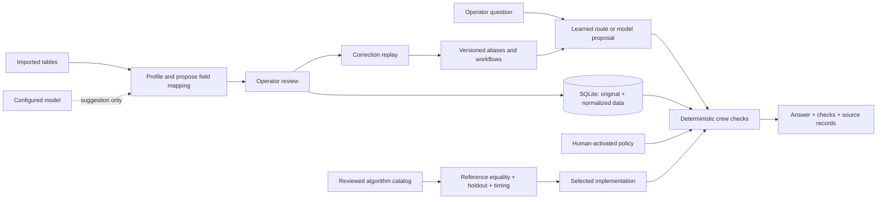

# Architecture

The model interprets a request or proposes a mapping. It does not generate executable code, perform operational arithmetic, or commit mutations. Its question plan is restricted to coverage, roster, summary, or clarification. The application generates the final factual response from the selected operation.

## Three improvement loops

**Data and workflow learning:** observe an accepted mapping or explicit correction, produce a candidate configuration, replay all saved cases, reject any failure, activate passing configuration, retain before/after states. Only the most recent active learning change can be rolled back. Learned mappings affect future imports. They do not retroactively transform existing records.

**Planning-policy improvement:** draft supported parameters, validate ranges, compare all crew-position results within the interactive check limit, show changed outcomes and newly failing existing assignments, wait for operator activation. A workspace revision change makes the comparison stale. The operator can restore an earlier policy by proposing its former values and comparing them against the current data.

**Algorithm improvement:** evaluate the reviewed catalog on seeded synthetic workloads, require full output equality with a separate reference path and held-out workloads, measure cold response time and allocation peaks, choose the lowest geometric-mean p95 strategy. The selected strategy changes implementation, not policy. Arbitrary generated algorithms are a future review/sandboxing problem, not an existing feature.

## Modules

| Module | Responsibility |
| --- | --- |
| data.py | File parsing, alias proposals, normalization, row validation |
| store.py | Transactions, source retention, revisions, learning evidence, audit events |
| engine.py | Crew candidate checks, roster, policy comparisons, reference and indexed strategies |
| learning.py | Correction replay, promotion, conflict rejection, rollback |
| optimize.py | Algorithm catalog, seeded workloads, scores, held-out equality checks |
| model.py | Bounded model requests and response parsing |
| app.py | Use cases, read snapshots, revision checks, bounded cache, benchmark activation |
| server.py | Local HTTP service, body limits, origin checks, workspace token |
| web/ | Accessible browser interface; no network assets or frontend build |

Assignment writes use `BEGIN IMMEDIATE` and recheck the supplied revision and crew eligibility in the same transaction. Concurrent requests cannot fill the same stale position. Cached answers are keyed by revision and copied before returning. Reads use a consistent database snapshot.

## Design

The interface uses shared CSS tokens for color, spacing surfaces, type, and controls. Navy navigation, a light operations surface, blue actions, and text-labelled green/amber/red states distinguish navigation from operational results. System fonts keep it self-contained. Tables scroll inside their panels on narrow screens; focus indicators, labelled inputs, status announcements, and reduced-motion support are built in.
